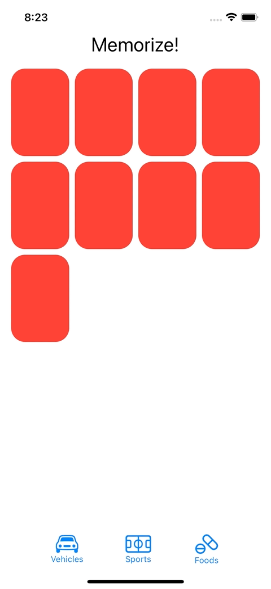

# Assignment 1
This is Assignment 1 from week2 in the course. 

## Screenshots

## Requirement
- [pdf contain all the assignment requirement](https://github.com/mohamedspicer/CS193p-Developing-Apps-for-iOS/blob/master/Assignment1-Memorize/assignment_1.pdf)

## Note
- All required tasks were developed plus the first extra-credit task
- The second extra-credit tasks were **not** developed

## Reasource

- https://cs193p.sites.stanford.edu/

